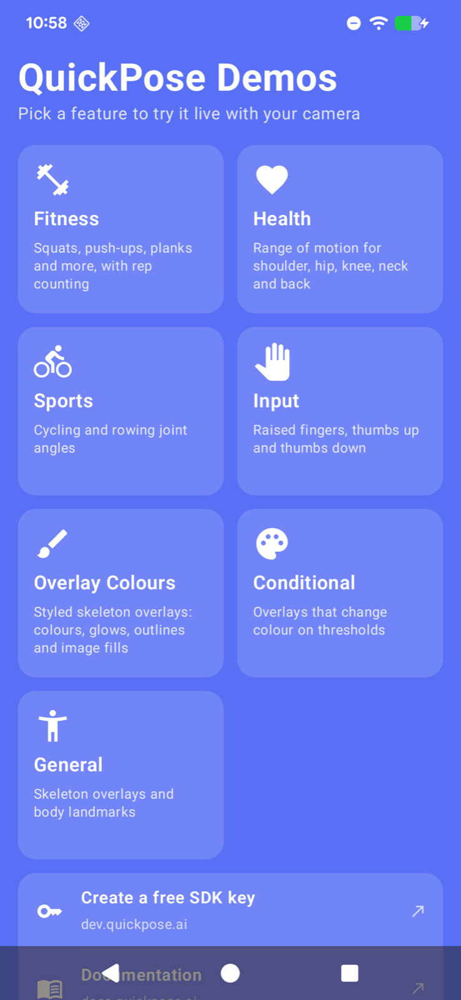
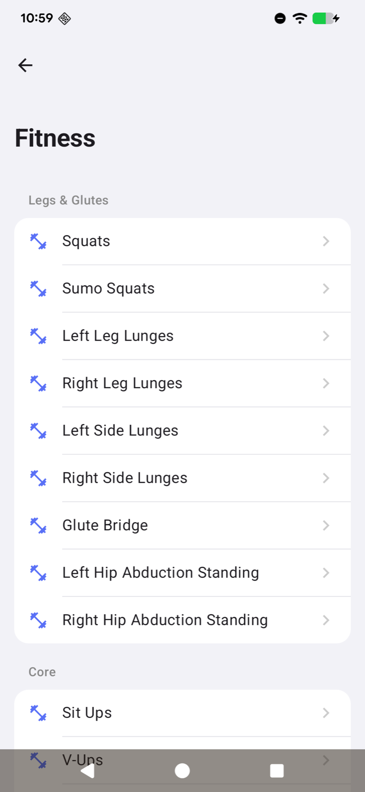

# QuickPose Android Demo App

The official Android demo app for [QuickPose](https://quickpose.ai) — an SDK for real-time AI pose estimation, fitness rep counting, and motion analysis, built on MediaPipe.

<p align="center">
  
  &nbsp;
  
</p>

Pick a feature from the landing page and try it live with your camera:

| Category | What it shows |
|---|---|
| **Fitness** | 30 exercises with automatic rep counting — squats, lunges, push-ups, bicep curls, skipping, burpees and more, grouped by muscle group. Planks show a hold timer. |
| **Health** | Range of motion measurement for shoulder, hip, knee, neck and back |
| **Sports** | Cycling/rowing joint angles (shoulder, elbow, hip, knee) |
| **Input** | Hands-free input: raised finger counting, thumbs up/down detection |
| **Overlay Colours** | Styled skeleton overlays — colours, line patterns, glows, shadows, outlines and image fills |
| **Conditional** | Overlays that change colour when a joint angle crosses a threshold |
| **General** | Skeleton overlays and raw body landmarks |

Every demo supports switching between the front and back camera, and sharing a screenshot of the camera with its overlay.

Looking for iOS? See the [QuickPose iOS Demo App](https://github.com/quickpose/quickpose-ios-demo-app).

## Requirements

- Android Studio with support for Android Gradle Plugin 9.2 (it bundles the JDK the build needs)
- Android SDK Platform 36.1, installed from Android Studio's SDK Manager
- An Android phone running Android 8.0 (API 26) or later — the demos need a real camera, so they don't run usefully on an emulator
- A free QuickPose SDK key

## Getting Started

### 1. Get the code

```bash
git clone https://github.com/quickpose/quickpose-android-demo-app.git
```

The QuickPose SDK comes from Maven Central (`ai.quickpose:quickpose-core` and `ai.quickpose:quickpose-mp`), so there's nothing else to clone.

### 2. Get a free SDK key

Register at [dev.quickpose.ai](https://dev.quickpose.ai) — it takes a minute and the key is free. SDK keys are linked to your app's application ID, which is `ai.quickpose.demo` in this project; if you change the application ID in `app/build.gradle.kts`, register a key for the new one.

Paste your key into [`QuickPoseConfig.kt`](app/src/main/java/ai/quickpose/demo/QuickPoseConfig.kt):

```kotlin
object QuickPoseConfig {
    const val SDK_KEY = "YOUR SDK KEY HERE" // paste your key here
}
```

The app reminds you on launch if the key is missing.

### 3. Run

Open the project folder in Android Studio, connect your phone with USB debugging enabled, and press Run.

To try it on an Intel-based emulator anyway, add `"x86_64"` to `abiFilters` in `app/build.gradle.kts` — the build only packages the ARM libraries real phones use, to keep the APK small.

## Project Structure

```
app/src/main/java/ai/quickpose/
├── demo/
│   ├── MainActivity.kt        # Entry point, navigation, camera permission
│   ├── QuickPoseConfig.kt     # Your SDK key
│   ├── LandingScreen.kt       # Feature categories, links, SDK key reminder
│   ├── FeatureListScreen.kt   # Menu of demos for a category
│   ├── DemoScreen.kt          # Live camera: overlays, rep counter, hold timer, feedback
│   └── DemoCatalog.kt         # Every demo: fitness sections, overlay style presets, etc.
└── camera/                    # Camera views from the QuickPose SDK repo, used as-is
```

Useful starting points if you're building your own app:

- `DemoCatalog.fitnessSections()` — the full list of rep-counted exercises
- `DemoCatalog.overlayStylePresets()` — overlay styling with `Style`
- `CameraDemo` in `DemoScreen.kt` — starting and stopping QuickPose with the screen's lifecycle, reading results in `onFrame`, counting reps with `QuickPoseThresholdCounter`, and timing holds with `QuickPoseThresholdTimer`

## Links

- 🔑 [Get a free SDK key](https://dev.quickpose.ai)
- 📖 [Documentation](https://docs.quickpose.ai)
- 💻 [QuickPose Android SDK](https://github.com/quickpose/quickpose-android-sdk)
- 🌐 [quickpose.ai](https://quickpose.ai)

## Support

Questions or issues? Open an issue on this repo or reach out via [quickpose.ai](https://quickpose.ai).
